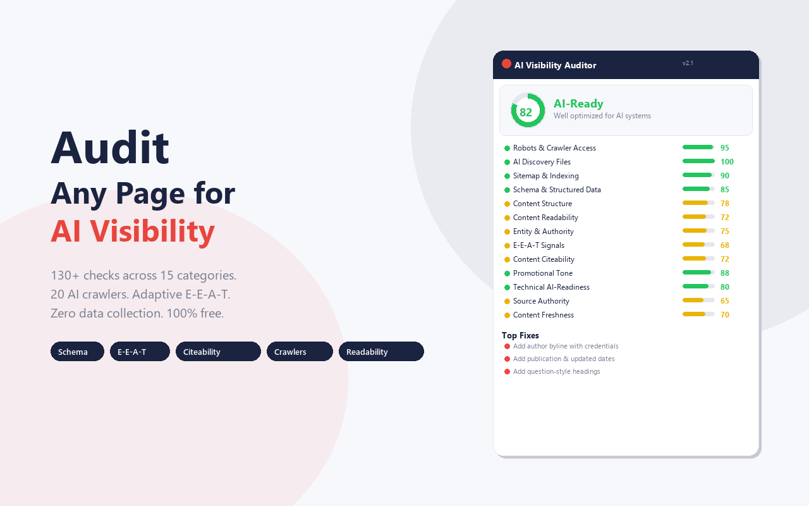
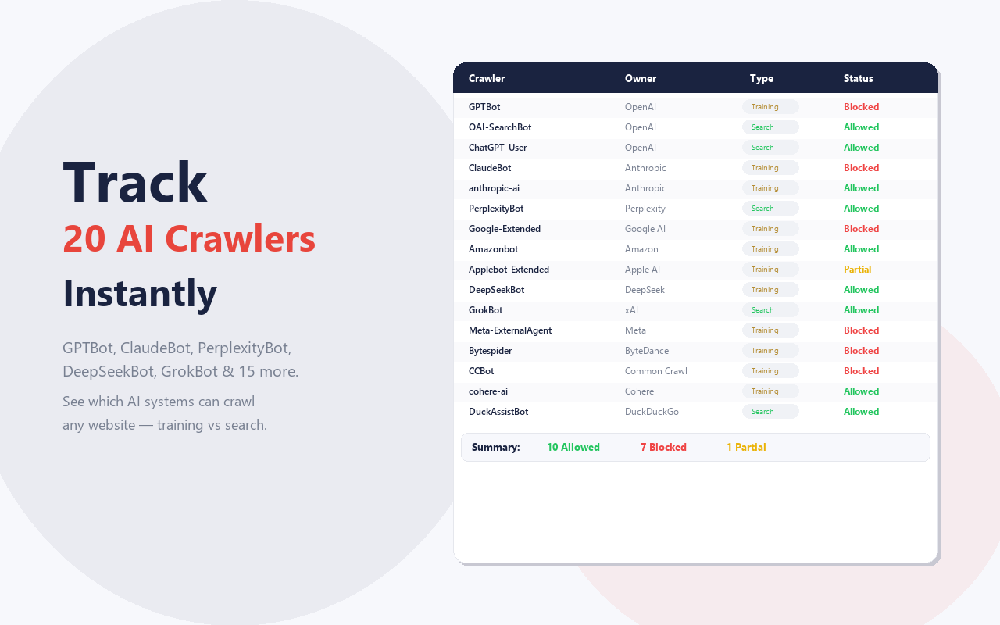
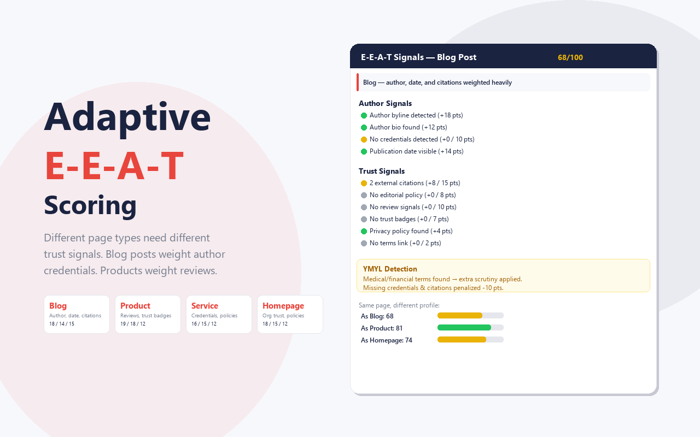
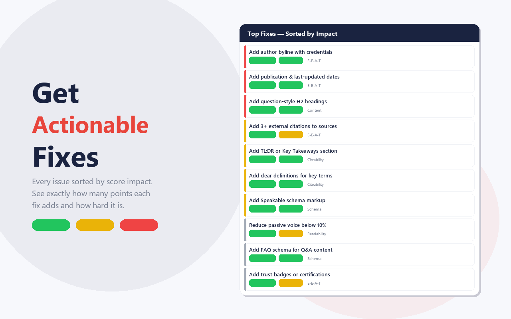

# AI Visibility Auditor

**The deepest free AI visibility audit for any webpage.** Chrome Extension that runs 120+ checks across 15 categories to evaluate how well a page is optimized for AI systems like ChatGPT, Perplexity, Claude, and Google AI Overviews.

[](https://chromewebstore.google.com/detail/pdfccbiffiihohnjfiofidldfjnahlkh)
[]()
[]()

---

## What It Does

Click the extension on any webpage and instantly get a scored audit across 6 layers:

| Layer | What It Checks |
|-------|---------------|
| **Crawler Access** | robots.txt rules for 20 AI crawlers (GPTBot, ClaudeBot, PerplexityBot, DeepSeekBot, GrokBot, etc.) |
| **Structured Data** | Schema.org validation across 30+ types with 3-tier depth analysis |
| **Content Signals** | llms.txt presence and format validation, sitemap discovery |
| **E-E-A-T** | Page-type adaptive scoring (blog/product/YMYL) for Experience, Expertise, Authoritativeness, Trust |
| **Citeability** | Answer capsule detection, stat attribution quality, quotable content blocks |
| **Content Quality** | Promotional tone detection (5-signal), readability score (ARI), passive voice analysis |

### Key Features

- **120+ individual checks** across 15 scored categories
- **20 AI crawlers tracked** including GPTBot, ClaudeBot, PerplexityBot, DeepSeekBot, GrokBot, Meta-ExternalAgent
- **Page-type adaptive E-E-A-T** - different scoring weights for blog posts, product pages, and YMYL content
- **Promotional tone detector** - 5-signal research-backed analysis
- **Agent vs Human view** - content visibility percentage comparison
- **Scan history and trends** - track improvements over time
- **Full report export** - branded HTML report + CSV export
- **100% client-side** - zero data leaves your browser, zero external API calls

---

## Screenshots

<p align="center">
  
  
  
</p>

<p align="center">
  
  
</p>

---

## Architecture

```
User clicks extension
       |
       v
  popup.js ──> injects content.js into active tab
       |              |
       |              v
       |        DOM extraction:
       |        - Schema (JSON-LD, Microdata)
       |        - Headings, meta tags
       |        - E-E-A-T signals
       |        - Citeability markers
       |        - Readability metrics
       |        - Promotional tone signals
       |
       v
  background.js (service worker)
       |
       v
  Fetches server-side files:
  - robots.txt (20 crawler rules)
  - llms.txt / llms-full.txt
  - sitemap.xml (multi-format)
  - NDJSON feeds
       |
       v
  Scoring Engine (popup.js)
  - Weighted category scores
  - Failures-first sorting
  - Recommendations generator
       |
       v
  Render in popup / Full report (new tab)
```

---

## Tech Stack

- **Manifest V3** Chrome Extension
- **Vanilla JS** - zero framework dependencies in production
- **Service Worker** for background fetching
- **chrome.scripting API** for content script injection
- **chrome.storage.local** for scan history and report data
- **Node.js** tooling: ESLint 9, Prettier, custom build scripts

---

## Development

```bash
# Install dev dependencies
npm install

# Lint + format
npm run lint
npm run format

# Run tests
npm test

# Build (src/ -> dist/)
npm run build

# Full release pipeline (lint + format + test + validate + build + pack)
npm run release
```

### Load locally
1. `npm run build`
2. Open `chrome://extensions/`
3. Enable Developer mode
4. Click "Load unpacked" and select the `dist/` folder

---

## Privacy

This extension processes everything locally in your browser. It makes **zero external API calls** and **sends zero data** to any server. The only network requests are to the audited website itself (robots.txt, sitemap.xml, llms.txt).

---

## Author

**Sunil Pratap Singh**
- SEO & AI Visibility Consultant | 15+ years in search
- Creator of the [Search Signal Framework](https://sunilpratapsingh.com)
- [sunilpratapsingh.com](https://sunilpratapsingh.com)

---

## License

Proprietary. All rights reserved.
